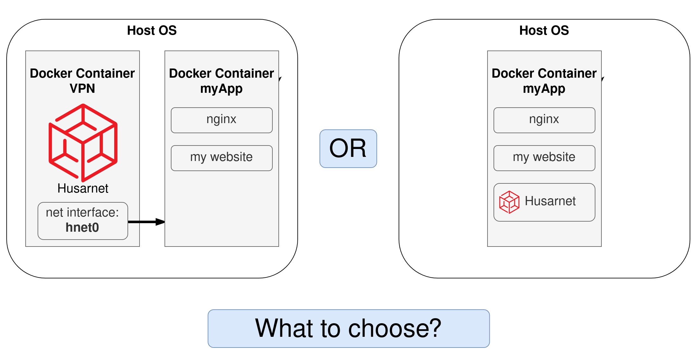
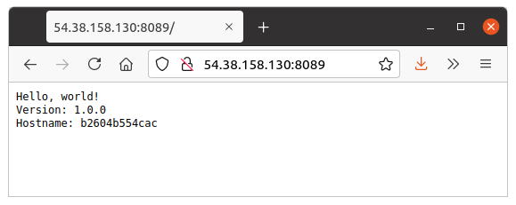

<!-- # nginx-reverse-proxy-docker -->

# Using Husarnet Docker Image

In the recent blog posts we presented how to embed Husarnet Client inside a Docker container. This solution is fine, however has a few drawbacks like:
- you need to modify your existing containers
- you need to install one instance of Husarnet Client per each container you want to connect (and manage multiple hostnames)

To overcome those issues we introduce an official [Husarnet Docker Image](https://hub.docker.com/r/husarnet/husarnet), that utilizes a [sidecar Docker design pattern](https://www.magalix.com/blog/the-sidecar-pattern). You can run this container next to your existing containers to share the VPN network from a Husarnet Container to one or multiple other containers at once.



## Introducing Husarnet Sidecar Docker Image

TODO: napisać więcej o co w tym wszystkim chodzi i jak to działa (że w `docker-compose.yml` w definicji kontenera Husarnetu daje się listę innych kontenerów, którym udostępnia się sieć)

...

## Example system architecture

<todo: plik draw.io gdzie narysujemy jak to działa>

Benefits:

#### 1. saving IP addresses space

you need only one public IP address associated with your reverse proxy server. Other services can be hosted even from your local LAN network, even if you have dynamic IP.

#### 2. running a website from your laptop / Raspberry Pi

#### 3. security - your application servers do not need to has public or static IP at all

## Install Docker and Docker Compose

Do that both on your laptop and on VPS.

[The official instruction](https://docs.docker.com/get-docker/) is the best tutorial but here's a quick rundown for you (for Linux):

```bash
sudo -E apt-get -y install apt-transport-https ca-certificates software-properties-common && \
curl -sL https://download.docker.com/linux/ubuntu/gpg | sudo apt-key add - && \
arch=$(dpkg --print-architecture) && \
sudo -E add-apt-repository "deb [arch=${arch}] https://download.docker.com/linux/ubuntu $(lsb_release -cs) stable" && \
sudo -E apt-get update && \
sudo -E apt-get -y install docker-ce docker-compose
```

```bash
sudo systemctl daemon-reload
sudo systemctl restart docker
```

## Installing laptop / Raspberry Pi part (sample web server)

1. Clone and create `.env` file

```bash
git clone https://github.com/DominikN/nginx-reverse-proxy-docker.git
cd nginx-reverse-proxy-docker/raspberry_pi/
touch .env
```

Edit `.env` file and add your Husarnet Join Code and hostname here:

```
HOSTNAME=my-vps
JOINCODE=fc94:b01d:1803:8dd8:b293:5c7d:7639:932a/xxxxxxxxxxxxxxxxxxxxxx
```

3. And start a container:

```bash
docker-compose up
```

you should see a similar log:

```bash
$ docker-compose up
Starting raspberry_pi_my-server_1 ... done
Starting raspberry_pi_husarnet_1  ... done
Attaching to raspberry_pi_my-server_1, raspberry_pi_husarnet_1
husarnet_1   | Waiting for the husarnet daemon to start
my-server_1  | 2021/06/12 12:38:38 Server listening on port 8080
husarnet_1   | [42893930] joining...
husarnet_1   | [42895931] joining...
husarnet_1   | [42897932] joining...
husarnet_1   | [42899932] joining...
husarnet_1   | [42901933] joining...
husarnet_1   | Husarnet IP address: fc94:f4b2:9ffc:c3a5:93b4:b873:9ae1:67da
```

save the Husarnet IPv6 address

## Installing VPS Part (nginx proxy)

1. Clone and create `.env` file

```bash
git clone https://github.com/DominikN/nginx-reverse-proxy-docker.git
cd nginx-reverse-proxy-docker/vps/
touch .env
```

Edit `.env` file and add your Husarnet Join Code and hostname here:

```
HOSTNAME=my-vps
JOINCODE=fc94:b01d:1803:8dd8:b293:5c7d:7639:932a/xxxxxxxxxxxxxxxxxxxxxx
```

2. Edit `nginx.conf` file and add place Husarnet IPv6 address of a Husarnet Client running on Raspberry Pi in this field:

```
server {  
    listen 8089;
    listen [::]:8089;

    location / {
        set $myupstream http://[fc94:f4b2:9ffc:c3a5:93b4:b873:9ae1:67da]:8080;
        proxy_pass $myupstream;
    }
}
```

3. And start a container:

```
docker-compose up
```

## Testing Reverse Proxy Server

In your favourite browser you can now access your website working on Raspberry Pi by using a proxy server public IP address and port `8089` (can be changed in `/vps/docker-compose.yml` file).




## Summary

Using Husarnet Container next to your existing container is a smart move because:
- you have clean & elegant architecture
- ...

We hope you will find this article helpful.

We would be happy to discuss the topic covered in this blog post on Husarnet Community Forum.


----------------------

## RANDOM NOTES
## important files to make hostnames work

understanding hostname resolution (why `resolver 127.0.0.11` works):


(https://serverfault.com/questions/118923/difference-between-etc-hosts-and-etc-resolv-conf)

1. `/etc/hosts`
2. `/etc/nsswitch.conf`
3. `/etc/resolv.conf`